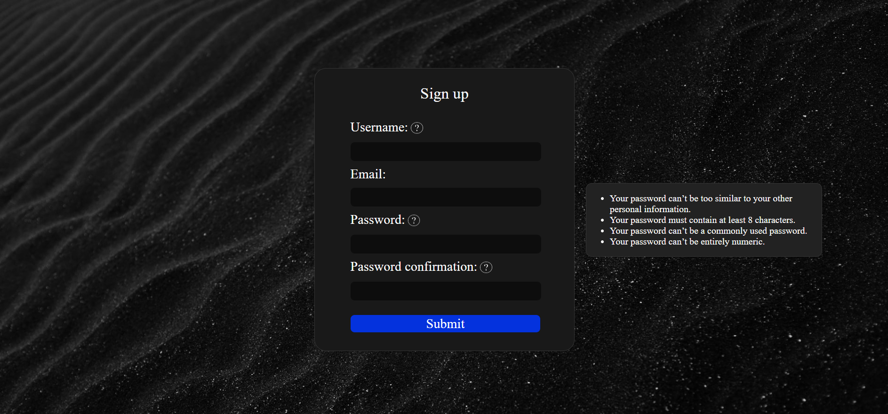
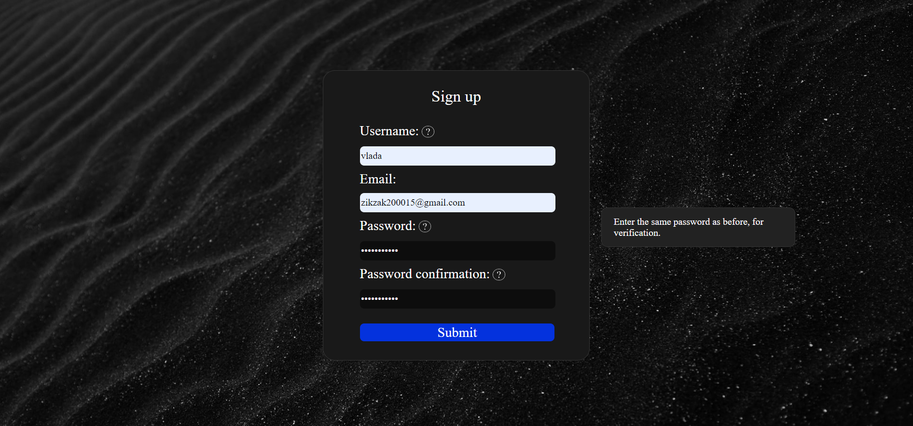
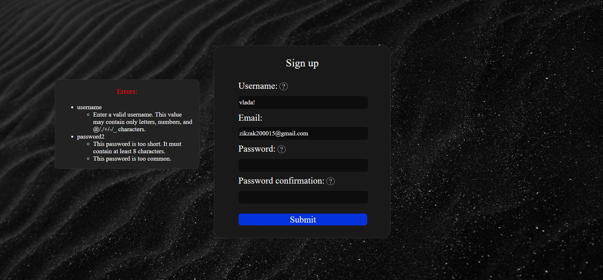
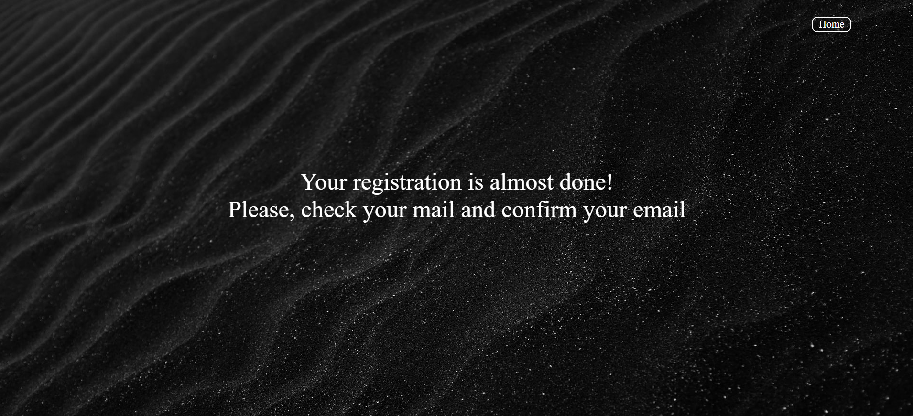
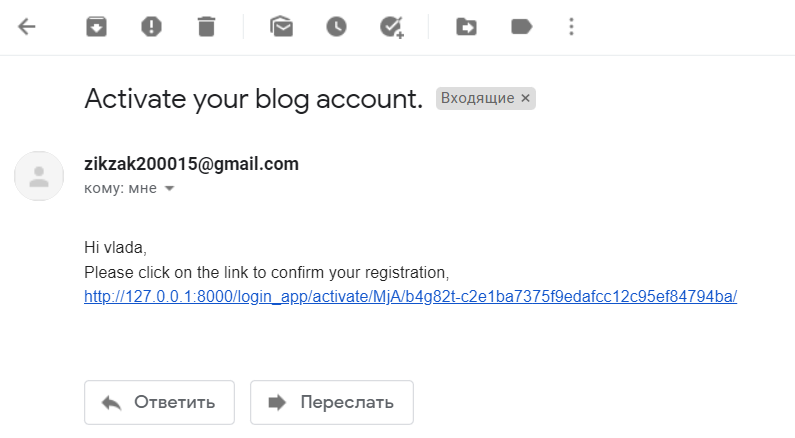
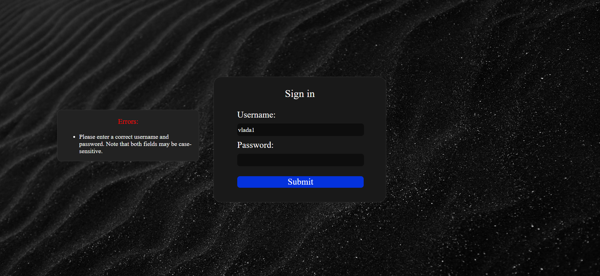

# django-login-app

### Introduction
In this project you can register and login on site with email confirmation. It is made using Django/SQLite/HTML/CSS/JS.

### Home page
So, the first page consists of logo with some introduction text and two links: sign in and sign up. 

 

### Sign up page
On the sign up page you can see form for registration with help images. When you click on help image near some field name, help text for this field appears on the right side.

 
 

If values that are entered are not suitable, errors text appears on the left side.

 

When sign up is successful, you are redirected to this page:

### Account activation
When you have registred, you will get an email with activation link:

After you clicked on the link, site page will open and you will be logged in.

If link is invalid, you will get this message: 

### Sign in

On the sign in page you can see form for login. If values are incorrect or user email is not confirmed, the errors text will appear on the left side.
  
 

After login, you will be redirected to logged page.

### Photoshop design

Here is a google drive link where PSD template of the login app and logo are stored:

https://drive.google.com/drive/folders/1CBt4KqMGVPyAfDZVKuFWZdA507qNuYX4?usp=sharing